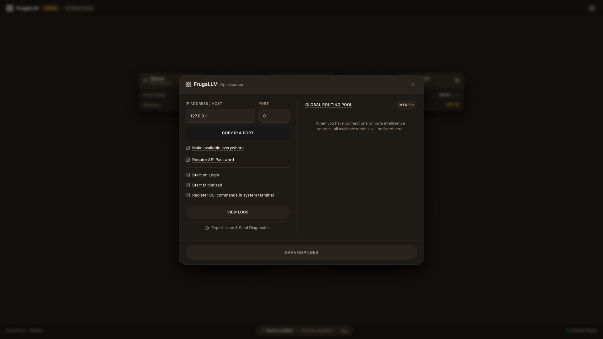
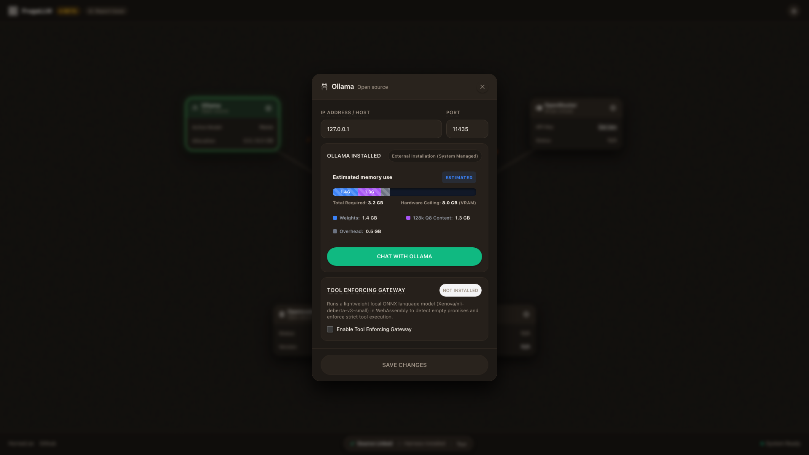
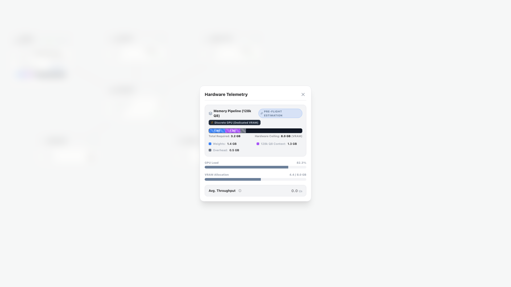
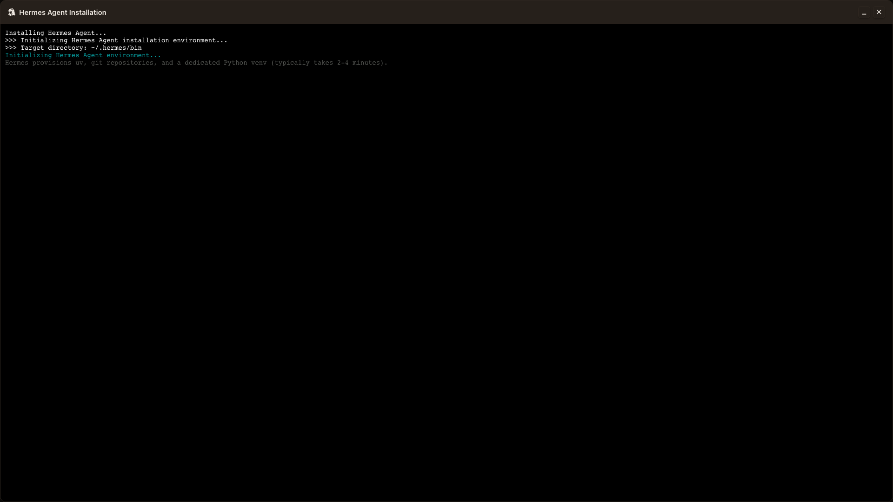
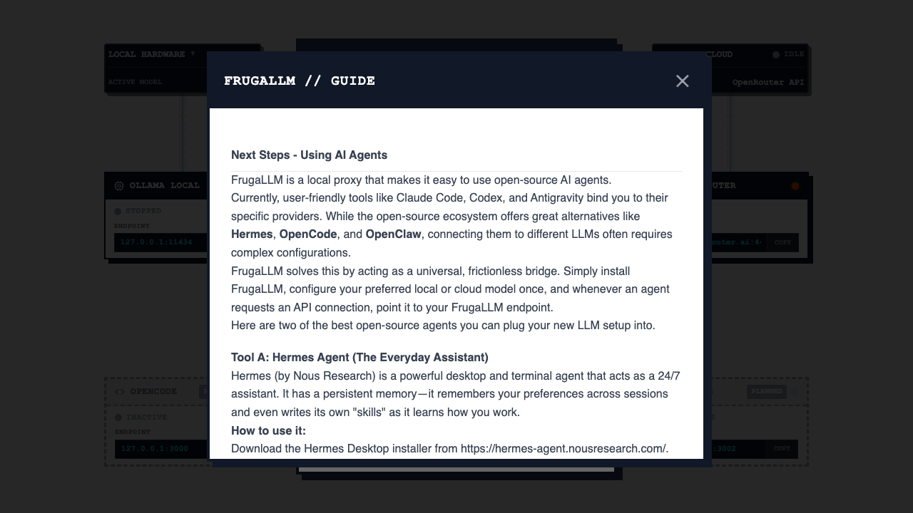

# Copy Audit

This document outlines the hardcoded user-facing strings discovered in the FrugaLLM v1 frontend and their proposed keys in the centralized JSON dictionary.

## Main Canvas

| Key | Current Text | Context/Location |
| :--- | :--- | :--- |
| `routingGraph.nodes.ollamaLocal.label` | `OLLAMA LOCAL` | `src/App.tsx` (App > initialNodes) |
| `routingGraph.nodes.ollamaLocal.description` | `Your private, local brain! Ollama runs lightweight open-source models right on your machine, keeping your data entirely private and free from cloud costs.` | `src/App.tsx` (App > initialNodes) |
| `routingGraph.nodes.openRouter.label` | `OPENROUTER` | `src/App.tsx` (App > initialNodes) |
| `routingGraph.nodes.openRouter.description` | `The ultimate gateway to the cloud! OpenRouter acts as a smart multiplexer, automatically routing your requests to the best and cheapest proprietary AI models available.` | `src/App.tsx` (App > initialNodes) |
| `routingGraph.nodes.localHardware.label` | `LOCAL HARDWARE` | `src/App.tsx` (App > initialNodes) |
| `routingGraph.nodes.localHardware.description` | `GPU and CPU resources dedicated to local inference.` | `src/App.tsx` (App > initialNodes) |
| `routingGraph.nodes.externalCloud.label` | `EXTERNAL CLOUD` | `src/App.tsx` (App > initialNodes) |
| `routingGraph.nodes.externalCloud.description` | `Routing to external API providers.` | `src/App.tsx` (App > initialNodes) |
| `routingGraph.nodes.frugallmCore.label` | `FRUGALLM CORE` | `src/App.tsx` (App > initialNodes) |
| `routingGraph.nodes.frugallmCore.description` | `The true mastermind of the operation. FrugalLM acts as your central hub, intercepting prompts and dynamically routing them to save you serious money without sacrificing quality!` | `src/App.tsx` (App > initialNodes) |
| `routingGraph.nodes.openCode.label` | `OPENCODE` | `src/App.tsx` (App > initialNodes) |
| `routingGraph.nodes.openCode.description` | `Your AI pair programmer, living right inside your IDE! OpenCode connects directly to the hub to give you brilliant, context-aware coding suggestions as you type.` | `src/App.tsx` (App > initialNodes) |
| `routingGraph.nodes.hermes.label` | `HERMES` | `src/App.tsx` (App > initialNodes) |
| `routingGraph.nodes.hermes.description` | `Say hello to Hermes, your internal AI chat interface! It's not just for chatting; Hermes can kick off complex, multi-step agent workflows to get real work done.` | `src/App.tsx` (App > initialNodes) |

## Node Configuration Panel

| Key | Current Text | Context/Location |
| :--- | :--- | :--- |
| `routingGraph.nodeConfigPanel.inputs.schemaPath.label` | `SCHEMA PATH` | `src/components/NodeConfigPanel.tsx` |
| `routingGraph.nodeConfigPanel.inputs.schemaPath.helpText` | `Think of this as the agent's strict instruction manual. By giving it a JSON schema, we force the AI to return data in the exact structure your application expects. No more messy text—just clean data!` | `src/components/NodeConfigPanel.tsx` |
| `routingGraph.nodeConfigPanel.inputs.workingDir.label` | `WORKING DIR (CWD)` | `src/components/NodeConfigPanel.tsx` |
| `routingGraph.nodeConfigPanel.inputs.workingDir.helpText` | `Where should the agent live while it works? This is the folder on your computer where the agent will run commands and look for files. It's basically the agent's home base.` | `src/components/NodeConfigPanel.tsx` |
| `routingGraph.nodeConfigPanel.inputs.executable.label` | `EXECUTABLE (BIN)` | `src/components/NodeConfigPanel.tsx` |
| `routingGraph.nodeConfigPanel.inputs.executable.helpText` | `Which program is actually doing the heavy lifting? This tells the system what tool to launch under the hood. Usually, it's 'agy' for our Antigravity agent, but you can plug in any CLI tool!` | `src/components/NodeConfigPanel.tsx` |
| `routingGraph.nodeConfigPanel.inputs.extraArgs.label` | `EXTRA ARGS (CSV)` | `src/components/NodeConfigPanel.tsx` |
| `routingGraph.nodeConfigPanel.inputs.extraArgs.helpText` | `Want to tweak how the agent runs? You can pass secret flags here (like '--verbose' to see its inner thoughts). Just list them out, separated by commas.` | `src/components/NodeConfigPanel.tsx` |
| `routingGraph.nodeConfigPanel.inputs.extraArgs.placeholder` | `--verbose, --force` | `src/components/NodeConfigPanel.tsx` |
| `routingGraph.nodeConfigPanel.inputs.instructionPrompt.label` | `INSTRUCTION PROMPT` | `src/components/NodeConfigPanel.tsx` |
| `routingGraph.nodeConfigPanel.inputs.instructionPrompt.helpText` | `This is your agent's main mission. Tell it exactly what you want it to accomplish. Be as specific as possible—the better the prompt, the better the results!` | `src/components/NodeConfigPanel.tsx` |
| `routingGraph.nodeConfigPanel.inputs.ipAddress.label` | `IP ADDRESS / HOST` | `src/components/NodeConfigPanel.tsx` |
| `routingGraph.nodeConfigPanel.inputs.ipAddress.helpText` | `Where does this service live on the network? Usually, it's right here on your computer ('127.0.0.1' or 'localhost'), but it could be a cloud API halfway across the world!` | `src/components/NodeConfigPanel.tsx` |
| `routingGraph.nodeConfigPanel.inputs.port.label` | `PORT` | `src/components/NodeConfigPanel.tsx` |
| `routingGraph.nodeConfigPanel.inputs.port.helpText` | `Think of the IP address as the building, and the Port as the specific door to knock on. It's how our hub knows exactly where to send its messages.` | `src/components/NodeConfigPanel.tsx` |
| `routingGraph.nodeConfigPanel.inputs.bindAllInterfaces.label` | `Make available everywhere` | `src/components/NodeConfigPanel.tsx` |
| `routingGraph.nodeConfigPanel.inputs.bindAllInterfaces.helpText` | `Making FrugaLLM available everywhere means it will detect traffic from all your network connections. Do not enable this if you only using FrugaLLM on one machine.` | `src/components/NodeConfigPanel.tsx` |
| `routingGraph.nodeConfigPanel.inputs.apiPassword.label` | `API PASSWORD (OPTIONAL)` | `src/components/NodeConfigPanel.tsx` |
| `routingGraph.nodeConfigPanel.inputs.apiPassword.helpText` | `Set an API token to secure your FrugalLM node.` | `src/components/NodeConfigPanel.tsx` |
| `routingGraph.nodeConfigPanel.inputs.apiPassword.placeholder` | `Super secret...` | `src/components/NodeConfigPanel.tsx` |
| `routingGraph.nodeConfigPanel.inputs.apiPassword.buttons.overwrite` | `OVERWRITE EXISTING PASSWORD?` | `src/components/NodeConfigPanel.tsx` |
| `routingGraph.nodeConfigPanel.inputs.apiPassword.buttons.removePrompt` | `REMOVE PASSWORD?` | `src/components/NodeConfigPanel.tsx` |
| `routingGraph.nodeConfigPanel.inputs.apiPassword.buttons.yes` | `YES` | `src/components/NodeConfigPanel.tsx` |
| `routingGraph.nodeConfigPanel.inputs.apiPassword.buttons.no` | `NO` | `src/components/NodeConfigPanel.tsx` |
| `routingGraph.nodeConfigPanel.inputs.apiPassword.buttons.apply` | `APPLY PASSWORD` | `src/components/NodeConfigPanel.tsx` |
| `routingGraph.nodeConfigPanel.inputs.apiPassword.buttons.remove` | `REMOVE` | `src/components/NodeConfigPanel.tsx` |
| `routingGraph.nodeConfigPanel.inputs.openRouterApiKey.label` | `API KEY` | `src/components/NodeConfigPanel.tsx` |
| `routingGraph.nodeConfigPanel.inputs.openRouterApiKey.helpText` | `Your OpenRouter API Key. This will be securely saved into your operating system's native Keychain!` | `src/components/NodeConfigPanel.tsx` |
| `routingGraph.nodeConfigPanel.inputs.openRouterApiKey.placeholder` | `sk-or-v1-...` | `src/components/NodeConfigPanel.tsx` |
| `routingGraph.nodeConfigPanel.stats.sessionTokens` | `SESSION TOKENS` | `src/components/NodeConfigPanel.tsx` |
| `routingGraph.nodeConfigPanel.stats.lifetimeTokens` | `LIFETIME TOKENS` | `src/components/NodeConfigPanel.tsx` |
| `routingGraph.nodeConfigPanel.stats.estLifetimeSavings` | `EST. LIFETIME SAVINGS` | `src/components/NodeConfigPanel.tsx` |
| `routingGraph.nodeConfigPanel.stats.savingsHelpText` | `Estimated savings assuming Claude 3.5 Sonnet pricing ($3.00/1M In, $15.00/1M Out)` | `src/components/NodeConfigPanel.tsx` |
| `routingGraph.nodeConfigPanel.stats.vramDetected` | `VRAM DETECTED (GB)` | `src/components/NodeConfigPanel.tsx` |
| `routingGraph.nodeConfigPanel.stats.vramHelpText` | `We tried to auto-detect your Video RAM, but you can correct this if it's wrong.` | `src/components/NodeConfigPanel.tsx` |
| `routingGraph.nodeConfigPanel.stats.recommendedModel` | `RECOMMENDED MODEL` | `src/components/NodeConfigPanel.tsx` |
| `routingGraph.nodeConfigPanel.stats.recommendedModelHelpText` | `Based on your VRAM, we'll pull this model for you!` | `src/components/NodeConfigPanel.tsx` |
| `routingGraph.nodeConfigPanel.stats.unsupportedVram` | `Unsupported (< 4GB VRAM)` | `src/components/NodeConfigPanel.tsx` |
| `routingGraph.nodeConfigPanel.actions.copyIpAndPort` | `COPY IP & PORT` | `src/components/NodeConfigPanel.tsx` |
| `routingGraph.nodeConfigPanel.actions.disconnect` | `DISCONNECT` | `src/components/NodeConfigPanel.tsx` |
| `routingGraph.nodeConfigPanel.actions.updateProtocol` | `UPDATE PROTOCOL` | `src/components/NodeConfigPanel.tsx` |
| `routingGraph.nodeConfigPanel.actions.help` | `HELP` | `src/components/NodeConfigPanel.tsx` |
| `routingGraph.nodeConfigPanel.actions.hermes.missing` | `HERMES AGENT MISSING` | `src/components/NodeConfigPanel.tsx` |
| `routingGraph.nodeConfigPanel.actions.hermes.prerequisite` | `Prerequisite: Connect Ollama or OpenRouter first.` | `src/components/NodeConfigPanel.tsx` |
| `routingGraph.nodeConfigPanel.actions.hermes.initialize` | `INITIALIZE HERMES` | `src/components/NodeConfigPanel.tsx` |
| `routingGraph.nodeConfigPanel.actions.hermes.installed` | `HERMES AGENT INSTALLED` | `src/components/NodeConfigPanel.tsx` |
| `routingGraph.nodeConfigPanel.actions.hermes.launchDesktop` | `LAUNCH DESKTOP` | `src/components/NodeConfigPanel.tsx` |
| `routingGraph.nodeConfigPanel.actions.hermes.launchWebUi` | `LAUNCH WEBUI` | `src/components/NodeConfigPanel.tsx` |
| `routingGraph.nodeConfigPanel.actions.hermes.uninstall` | `UNINSTALL HERMES` | `src/components/NodeConfigPanel.tsx` |
| `routingGraph.nodeConfigPanel.actions.opencode.missing` | `OPENCODE AGENT MISSING` | `src/components/NodeConfigPanel.tsx` |
| `routingGraph.nodeConfigPanel.actions.opencode.initialize` | `INITIALIZE OPENCODE` | `src/components/NodeConfigPanel.tsx` |
| `routingGraph.nodeConfigPanel.actions.opencode.installed` | `OPENCODE AGENT INSTALLED` | `src/components/NodeConfigPanel.tsx` |
| `routingGraph.nodeConfigPanel.actions.opencode.launch` | `LAUNCH OPENCODE` | `src/components/NodeConfigPanel.tsx` |
| `routingGraph.nodeConfigPanel.actions.opencode.uninstall` | `UNINSTALL OPENCODE` | `src/components/NodeConfigPanel.tsx` |
| `routingGraph.nodeConfigPanel.actions.ollama.missing` | `OLLAMA MISSING` | `src/components/NodeConfigPanel.tsx` |
| `routingGraph.nodeConfigPanel.actions.ollama.initialize` | `INITIALIZE OLLAMA` | `src/components/NodeConfigPanel.tsx` |
| `routingGraph.nodeConfigPanel.actions.ollama.installed` | `OLLAMA INSTALLED` | `src/components/NodeConfigPanel.tsx` |
| `routingGraph.nodeConfigPanel.actions.ollama.chat` | `CHAT WITH OLLAMA` | `src/components/NodeConfigPanel.tsx` |
| `routingGraph.nodeConfigPanel.actions.ollama.uninstall` | `UNINSTALL OLLAMA` | `src/components/NodeConfigPanel.tsx` |
| `routingGraph.nodeConfigPanel.actions.openRouter.connected` | `OPENROUTER CONNECTED` | `src/components/NodeConfigPanel.tsx` |
| `routingGraph.nodeConfigPanel.actions.common.areYouSure` | `ARE YOU SURE?` | `src/components/NodeConfigPanel.tsx` |
| `routingGraph.nodeConfigPanel.actions.common.workspaceFolder` | `WORKSPACE FOLDER` | `src/components/NodeConfigPanel.tsx` |
| `routingGraph.nodeConfigPanel.actions.common.kill` | `KILL` | `src/components/NodeConfigPanel.tsx` |
| `routingGraph.nodeConfigPanel.actions.common.editSoul` | `EDIT SOUL.MD` | `src/components/NodeConfigPanel.tsx` |

## Node Widgets

| Key | Current Text | Context/Location |
| :--- | :--- | :--- |
| `routingGraph.nodeWidgets.common.copy` | `COPY` | `src/components/NodeWidgets.tsx` |
| `routingGraph.nodeWidgets.common.copied` | `✓ OK` | `src/components/NodeWidgets.tsx` |
| `routingGraph.nodeWidgets.common.idle` | `IDLE` | `src/components/NodeWidgets.tsx` |
| `routingGraph.nodeWidgets.common.loading` | `LOADING` | `src/components/NodeWidgets.tsx` |
| `routingGraph.nodeWidgets.common.thinking` | `THINKING` | `src/components/NodeWidgets.tsx` |
| `routingGraph.nodeWidgets.common.loaded` | `LOADED` | `src/components/NodeWidgets.tsx` |
| `routingGraph.nodeWidgets.common.planned` | `PLANNED` | `src/components/NodeWidgets.tsx` |
| `routingGraph.nodeWidgets.common.hubOnline` | `HUB ONLINE` | `src/components/NodeWidgets.tsx` |
| `routingGraph.nodeWidgets.common.endpoint` | `ENDPOINT` | `src/components/NodeWidgets.tsx` |
| `routingGraph.nodeWidgets.common.running` | `RUNNING` | `src/components/NodeWidgets.tsx` |
| `routingGraph.nodeWidgets.common.binary` | `BINARY` | `src/components/NodeWidgets.tsx` |
| `routingGraph.nodeWidgets.common.connected` | `CONNECTED` | `src/components/NodeWidgets.tsx` |
| `routingGraph.nodeWidgets.common.stopped` | `STOPPED` | `src/components/NodeWidgets.tsx` |
| `routingGraph.nodeWidgets.common.standby` | `STANDBY` | `src/components/NodeWidgets.tsx` |
| `routingGraph.nodeWidgets.common.host` | `HOST` | `src/components/NodeWidgets.tsx` |
| `routingGraph.nodeWidgets.common.none` | `None` | `src/components/NodeWidgets.tsx` |
| `routingGraph.nodeWidgets.hardwareNode.activeModel` | `Active Model` | `src/components/NodeWidgets.tsx` |
| `routingGraph.nodeWidgets.hardwareNode.cpuLoad` | `CPU Load` | `src/components/NodeWidgets.tsx` |
| `routingGraph.nodeWidgets.hardwareNode.gpuLoad` | `GPU Load` | `src/components/NodeWidgets.tsx` |
| `routingGraph.nodeWidgets.hardwareNode.ramAllocation` | `RAM Allocation` | `src/components/NodeWidgets.tsx` |
| `routingGraph.nodeWidgets.hardwareNode.vramAllocation` | `VRAM Allocation` | `src/components/NodeWidgets.tsx` |
| `routingGraph.nodeWidgets.hardwareNode.throughput` | `Throughput` | `src/components/NodeWidgets.tsx` |
| `routingGraph.nodeWidgets.hardwareNode.tokensPerSecond` | `t/s` | `src/components/NodeWidgets.tsx` |
| `routingGraph.nodeWidgets.cloudConnectNode.routing` | `ROUTING` | `src/components/NodeWidgets.tsx` |
| `routingGraph.nodeWidgets.cloudConnectNode.gateway` | `Gateway` | `src/components/NodeWidgets.tsx` |
| `routingGraph.nodeWidgets.cloudConnectNode.openRouterApi` | `OpenRouter API` | `src/components/NodeWidgets.tsx` |

## Hardware Telemetry Widget

| Key | Current Text | Context/Location |
| :--- | :--- | :--- |
| `routingGraph.hardwareTelemetryWidget.ollamaDaemonOffline` | `Ollama Daemon Offline` | `src/components/HardwareTelemetryWidget.tsx` |
| `routingGraph.hardwareTelemetryWidget.waitingForConnection` | `Waiting for connection...` | `src/components/HardwareTelemetryWidget.tsx` |
| `routingGraph.hardwareTelemetryWidget.gpu100` | `100% GPU` | `src/components/HardwareTelemetryWidget.tsx` |
| `routingGraph.hardwareTelemetryWidget.hybrid` | `HYBRID` | `src/components/HardwareTelemetryWidget.tsx` |
| `routingGraph.hardwareTelemetryWidget.cpuOnly` | `CPU ONLY` | `src/components/HardwareTelemetryWidget.tsx` |
| `routingGraph.hardwareTelemetryWidget.unknown` | `UNKNOWN` | `src/components/HardwareTelemetryWidget.tsx` |
| `routingGraph.hardwareTelemetryWidget.activeModel` | `ACTIVE MODEL` | `src/components/HardwareTelemetryWidget.tsx` |
| `routingGraph.hardwareTelemetryWidget.idle` | `Idle` | `src/components/HardwareTelemetryWidget.tsx` |
| `routingGraph.hardwareTelemetryWidget.cpuUtil` | `CPU UTIL` | `src/components/HardwareTelemetryWidget.tsx` |
| `routingGraph.hardwareTelemetryWidget.gpuUtil` | `GPU UTIL` | `src/components/HardwareTelemetryWidget.tsx` |
| `routingGraph.hardwareTelemetryWidget.vramUsage` | `VRAM USAGE` | `src/components/HardwareTelemetryWidget.tsx` |
| `routingGraph.hardwareTelemetryWidget.noModelLoaded` | `No model currently loaded in memory.` | `src/components/HardwareTelemetryWidget.tsx` |

## Terminal

| Key | Current Text | Context/Location |
| :--- | :--- | :--- |
| `routingGraph.terminal.confirmClose` | `This will terminate the running process. Are you sure?` | `src/App.tsx` (TerminalView) |
| `routingGraph.terminal.yes` | `Yes` | `src/App.tsx` (TerminalView) |
| `routingGraph.terminal.cancel` | `Cancel` | `src/App.tsx` (TerminalView) |
| `routingGraph.terminal.downloadingWeights` | `Downloading Weights...` | `src/App.tsx` (TerminalView) |
| `routingGraph.terminal.starting` | `Starting...` | `src/App.tsx` (TerminalView) |
| `routingGraph.terminal.startingOpenCode` | `Starting OpenCode...` | `src/App.tsx` (TerminalView) |
| `routingGraph.terminal.startingHermes` | `Starting Hermes Agent...` | `src/App.tsx` (TerminalView) |
| `routingGraph.terminal.startingOllama` | `Chatting with Ollama...` | `src/App.tsx` (TerminalView) |
| `routingGraph.terminal.exitedWithCode` | `{{name}} exited with code {{code}}` | `src/App.tsx` (TerminalView) |

## Guides

| Key | Current Text | Context/Location |
| :--- | :--- | :--- |
| `routingGraph.guides.quickstartTitle` | `FRUGALLM // QUICKSTART GUIDES` | `src/App.tsx` (Guides) |
| `routingGraph.guides.quickstartSubtitle` | `Welcome to the FrugalLLM Central Hub. Select a guide below to learn how to configure your neural topology and orchestrate your AI agents:` | `src/App.tsx` (Guides) |
| `routingGraph.guides.jsonSchemasTitle` | `Defining JSON Schemas` | `src/App.tsx` (Guides) |
| `routingGraph.guides.jsonSchemasSubtitle` | `Learn how to force agents to return strict data formats.` | `src/App.tsx` (Guides) |
| `routingGraph.guides.ollamaTitle` | `Connecting Local Ollama` | `src/App.tsx` (Guides) |
| `routingGraph.guides.ollamaSubtitle` | `How to run completely private models locally on port 11434.` | `src/App.tsx` (Guides) |
| `routingGraph.guides.openRouterTitle` | `Advanced OpenRouter Multiplexing` | `src/App.tsx` (Guides) |
| `routingGraph.guides.openRouterSubtitle` | `Route queries dynamically to save costs and avoid rate limits.` | `src/App.tsx` (Guides) |
| `routingGraph.guides.guideTitle` | `FRUGALLM // GUIDE` | `src/App.tsx` (Guides) |
