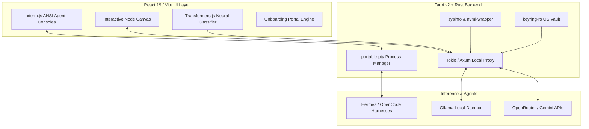

# FrugaLLM 🧠🔌

[](https://github.com/chorned/frugallm-app/actions/workflows/release.yml)
[](https://www.bestpractices.dev/projects/14664)
[](https://scorecard.dev/viewer/?uri=github.com/chorned/frugaLLM-App)
[](https://github.com/chorned/frugaLLM-App/actions/workflows/security.yml)
[](https://github.com/chorned/frugaLLM-App/actions/workflows/security.yml)
[](https://github.com/chorned/frugaLLM-App/network/updates)

**FrugaLLM is a high-performance, local-first desktop proxy and visual AI router.** It serves as an intelligent, cost-optimizing bridge connecting **Intelligence Sources** (local hardware via Ollama and free cloud tiers) with **Autonomous Agentic Harnesses** (OpenCode and Hermes).

By exposing a unified, OpenAI-compatible proxy endpoint, FrugaLLM allows developers to run complex autonomous agent loops against local models and cost-effective cloud APIs with drastically reduced—or zero—API expenditures.

---

## ⚡ Run Autonomous Agent Harnesses with Zero Money Down

Autonomous agent loops can burn through millions of tokens in minutes through terminal tool-calling, multi-file workspace refactors, and continuous self-correction. FrugaLLM removes the financial barrier to entry by decoupling the **"Brains"** (large language models) from the **"Hands"** (agent runtimes), letting you experiment and ship with zero upfront investment:

- 📉 **Zero-Cost Agent Loops:** Route high-frequency, token-heavy operations to free local models (via Ollama) or generous cloud tiers (Google AI Studio), escalating to frontier reasoning models only when task complexity warrants it.
- 🔀 **Visual Intelligence Routing:** An interactive, node-based topology canvas illustrating real-time data flows between client runtimes, the routing core, and upstream inference backends. Drop FrugaLLM's local proxy directly into any client application expecting an OpenAI endpoint.
- 📊 **Real-Time Spend & Token Observability:** Watch token flow and cost deltas live. FrugaLLM intercepts inbound agent requests, computes token volumes natively, and visualizes cumulative savings against standard frontier baselines.
- 🔒 **Native Vault Security & Privacy:** Sensitive API keys never touch plain configuration files. All credentials are encrypted and stored directly within hardware-backed operating system vaults (macOS Keychain, Windows Credential Manager, Linux Secret Service).
- 🎓 **Hardware-Aware Guided Onboarding:** A built-in, 6-step guided walkthrough analyzes physical system memory and GPU resources in real time to recommend optimal local versus cloud routing thresholds in under five minutes.

---

## 🏗️ Architecture & Stack Breakdown

FrugaLLM maintains a sub-50MB idle memory footprint by pairing a zero-overhead native systems engine with a full-duplex interactive terminal runtime, an in-browser neural router, and an ambient onboarding state machine.



### 1. Native Desktop Backend (`src-tauri` / Rust)
* **Tauri v2:** Provides lightweight desktop orchestration, native system tray integration, window state restoration (`tauri-plugin-window-state`), and strict inter-process communication (IPC) boundaries without the memory overhead of Chromium bundles.
* **Tokio (1.53) & Axum (0.8):** Multi-threaded asynchronous local proxy handling OpenAI-compatible endpoints, managing connection pooling, and streaming Server-Sent Events (SSE) chunks with sub-millisecond dispatch latency.
* **portable-pty:** Facilitates cross-platform pseudo-terminal creation and bidirectional I/O streaming across macOS PTYs, Linux PTYs, and Windows ConPTY.
* **keyring-rs (4.1):** Direct integration with native operating system credential stores to secure upstream API tokens.
* **sysinfo (0.39) & nvml-wrapper (0.13):** Continuous hardware telemetry monitoring host CPU usage, available physical RAM, and NVIDIA GPU VRAM allocation to dynamically assess local execution capacity.
* **reqwest (0.13) & futures-util:** High-throughput streaming HTTP client managing upstream connections and backpressure.

### 2. Client-Side Runtime (`package.json` / TypeScript)
* **React 19 & Vite 8:** Concurrent UI rendering engine with rapid hot-module replacement and strict TypeScript 5.8 static typing.
* **@huggingface/transformers (Transformers.js / ONNX Runtime):** In-browser neural execution for zero-latency prompt intent classification and tokenization before requests hit external networks.
* **@xterm/xterm (6.0) & @xterm/addon-fit:** Full ANSI terminal emulation driving the embedded execution consoles for autonomous agents.
* **Framer Motion (13.4) & Tailwind CSS (3.4):** Spring-physics animations for routing nodes, interactive drawers, and the design token system (`--zen-surface`, `--zen-border`, `--zen-accent`).
* **React Markdown (10.1) & Lucide React:** Live markdown stream rendering and unified iconography across provider nodes and hardware monitors.

### 3. Onboarding & Guided User Journey
* **Three-Phase State Machine (`useOnboarding.ts`):** Manages user lifecycles across `'fresh'` (initial launch), `'learning'` (active walkthrough), and `'completed'` (ambient workspace tracking). Supports complete wipe hygiene via `npm run wipe`.
* **Dynamic Spotlight Cutout (`OnboardingOverlay.tsx`):** A custom 4-quadrant HTML panel backdrop mounted via React Portals with `requestAnimationFrame` DOM tracking and automatic viewport edge-clamping.
* **Interactive Token Flow Simulator:** A non-linear slider demonstrating cost differences between local zero-cost routing and proprietary frontier models with live SVG canvas pulse animations.
* **Active Network Validation:** Live endpoint probing via native Tauri HTTP to verify API key validity prior to storing in the system keychain.

---

## 🚀 Installation & Quick Start

Pre-built desktop executables are published with every release for macOS, Windows, and Linux:

* **Download**: Grab the latest release package from [GitHub Releases](https://github.com/chorned/frugaLLM-App/releases/latest).
  * **macOS**: `frugallm-app_universal.dmg` (Universal binary for Apple Silicon & Intel)
  * **Windows**: `frugallm-app_x64-setup.exe` (Self-contained installer)
  * **Linux**: `frugallm-app_amd64.deb` or `.AppImage`

### Running from Source

Ensure you have [Node.js](https://nodejs.org/) (v24+) and [Rust](https://rust-lang.org/) installed:

```bash
# Clone the repository
git clone https://github.com/chorned/frugaLLM-App.git
cd frugaLLM-App

# Install frontend dependencies
npm install

# Run desktop app in development mode
npm run tauri dev
```

### Test Suite

```bash
# Run isolated Rust backend unit tests
npm run test:rust

# Run frontend unit and component tests with coverage
npm run test:unit
npm run test:coverage

# Run End-to-End browser tests and desktop smoke tests
npm run test:e2e
npm run test:smoke
```

---

## 🙏 Acknowledgements & Inspirations

FrugaLLM is built upon the discoveries, architectures, and open-source contributions of exceptional developer communities:

### Core Proxy Architecture & Observability
* **[LiteLLM](https://github.com/BerriAI/litellm):** The primary architectural reference for unified proxy design. LiteLLM established the pattern of normalizing disparate model endpoints, standardizing schemas, and tracking spend through an OpenAI-compatible interface.
* **[Langfuse](https://langfuse.com/):** The inspiration for granular LLM observability, cost tracing, and latency tracking, directly influencing FrugaLLM’s spend analytics dashboards.

### Autonomous Agent Ecosystem
* **[Hermes Agent](https://nousresearch.com/)** (Nous Research): Powers autonomous agent workflows, task execution nodes, and the local desktop butler layer.
* **[OpenCode](https://github.com/anomaly/opencode):** Powers our integrated development interpreter and autonomous codebase refactoring agent runtime.
* **[Google Antigravity](https://github.com/google/antigravity):** A foundational conceptual inspiration for task automation, execution plans, and terminal-based agent tool-calling loops.

### Model Providers & Local Inference
* **[Ollama](https://ollama.com/):** Pioneering accessible local model execution. Enables FrugaLLM to run quantized GGUF weights on user hardware with zero API overhead.
* **[OpenRouter](https://openrouter.ai/):** Provides our unified cloud model gateway, real-time pricing feeds, dynamic catalog discovery, and fallback capabilities.
* **Google Cloud & [Gemini API](https://deepmind.google/technologies/gemini/):** Scalable cloud inference, high-throughput context windows, and multimodal intelligence.
* **[Gemma](https://ai.google.dev/gemma)** (Google DeepMind): Lightweight open models running efficiently on local hardware.

### Native Systems & Desktop Technologies
* **[Tauri](https://tauri.app/)** & **[Rust](https://www.rust-lang.org/):** Providing secure native bindings, minimal idle memory consumption, and desktop process orchestration.
* **[Axum](https://github.com/tokio-rs/axum)**, **[Tokio](https://tokio.rs/)**, & **[Tower](https://github.com/tower-rs/tower):** Underpinning our high-concurrency local proxy server and streaming pipeline.
* **[portable-pty](https://github.com/wez/wezterm/tree/main/pty):** Cross-platform pseudo-terminal management across macOS, Windows, and Linux.
* **[keyring-rs](https://github.com/hwchen/keyring-rs):** Hardware-backed credential security across native OS vaults.
* **[sysinfo](https://github.com/GuillaumeGomez/sysinfo)** & **[nvml-wrapper](https://github.com/cmyr/nvml-wrapper):** Real-time hardware telemetry and GPU VRAM monitoring.

### Frontend, Interaction & Client-Side Intelligence
* **[Transformers.js](https://huggingface.co/docs/transformers.js)** & **[ONNX Runtime](https://onnxruntime.ai/):** Enabling on-device neural intent classification and tokenization with zero cloud roundtrips.
* **[xterm.js](https://xtermjs.org/):** Powering the embedded terminal emulator and real-time ANSI stream rendering for Hermes and OpenCode.
* **[React](https://react.dev/)**, **[Vite](https://vitejs.dev/)**, & **[Tailwind CSS](https://tailwindcss.com/):** Enabling our responsive visual canvas and desktop design system.
* **[Framer Motion](https://www.framer.com/motion/)** & **[Lucide Icons](https://lucide.dev/):** Supplying spring-physics canvas animations, transitions, and system iconography.
* **[React Markdown](https://github.com/remarkjs/react-markdown)** & **[canvas-confetti](https://github.com/catdad/canvas-confetti):** Real-time markdown parsing and celebratory interaction feedback.

### Quality Assurance & Telemetry
* **[Web3Forms](https://web3forms.com/):** Powering zero-backend client diagnostic reporting and automated unit test notifications.
* **[Playwright](https://playwright.dev/)**, **[Vitest](https://vitest.dev/)**, & **[WebdriverIO](https://webdriver.io/):** End-to-end browser automation, component verification, and native desktop smoke testing.

*(Note: All local models downloaded on-demand via Ollama remain the intellectual property of their respective creators and are governed by their own licensing and acceptable use terms.)*

---

## 🤝 Community & Contributing

Contributions are welcome! Please consult the [Contributing Guide](CONTRIBUTING.md) for local environment setup, architecture standards, and pull request workflows.

* **Changelog:** [CHANGELOG.md](CHANGELOG.md)
* **Security Policy:** [SECURITY.md](SECURITY.md)

---

## 📄 License

FrugaLLM is licensed under the [MIT License](LICENSE).
