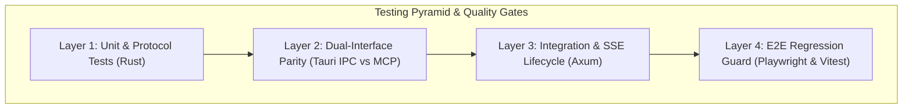

# Architectural Feasibility & Design Specification: MCP Agent Control & Headless Rust Core

**Issue Reference:** CHO-93 / CHO-88 / CHO-97  
**Author:** Hermes (@Hermes)  
**Status:** Approved for Architecture / Feasibility Complete  
**Decisions Locked:**
- **Tool Enforcing Gateway:** Option A (Lightweight Rust streaming AST/regex validator in Axum proxy middleware).
- **MCP Server Transport:** HTTP/SSE natively hosted on the Axum proxy port (`http://localhost:61721/mcp`).
- **Ticket Lifecycle:** CHO-93 is Marked **Done**; implementation will proceed in backlog tickets CHO-88 and CHO-97.

---

## 1. Executive Summary

This document evaluates and defines the architecture for:
1. Enabling an **AI Agent (via Model Context Protocol / MCP)** to perform **any action and query any information** currently available in the FrugaLLM GUI:
   - Full read parity: models, IPs, ports, service installation status, credential functioning checks, cloud connectivity tests, and Ollama VRAM hardware estimations.
   - Full write parity: restarting the proxy/daemon, configuring IP/ports, rebinding services, toggling tool gateway, managing credentials, and updating fallback rosters.
2. Operating FrugaLLM in a **Headless Mode** booting only the Rust core/daemon without Tauri windowing or WebKit/WebView overhead.

### Key Finding
**Overall Feasibility: FEASIBLE (High Confidence).**
All operational, hardware telemetry, configuration, process supervision, and routing logic is already built in Rust (`src-tauri/src/main.rs`, `model_db.rs`, `telemetry.rs`).

The only migration requirement is moving the **Tool Enforcing Gateway** from client-side WebAssembly (`src/services/onnxGateway.ts`) into a Rust Axum proxy middleware stream interceptor (**Option A: Lightweight Streaming AST/Regex Validator**).

---

## 2. Complete Capabilities Matrix: Frontend vs. MCP Agent

### A. Information & Read Parity (Inspection Tools)

| Front-end Capability | Current Implementation in Codebase | MCP Tool Specification |
| :--- | :--- | :--- |
| **Current Models & Roster** | `main.rs:1590` (`get_routing_chain`), `model_db.rs` (intelligence ranking) | `frugallm_get_models`: Returns active fallback chain, IQ scores, and local Ollama models. |
| **IPs & Active Ports** | `main.rs:2409` (`get_local_ips`), `main.rs:1540` (`get_frugallm_server_status`) | `frugallm_get_network_info`: Returns bound port, bind interface (0.0.0.0 vs 127.0.0.1), local IP addresses, and conflict/status flags. |
| **Service Installation Status** | `main.rs:434` (`check_hermes_status`), `main.rs:451` (`check_opencode_status`), `main.rs:486` (`check_ollama_status`), `main.rs:617` (`check_tool_gateway_status`) | `frugallm_get_service_status`: Returns installation status, daemon process state, and binary versions for Hermes, OpenCode, Ollama, and Tool Gateway. |
| **Cloud Token Validation & Testing** | `main.rs:1675` (Google `/v1beta/models`), `main.rs:1725` (OpenRouter `/v1/models`), keyring access | `frugallm_test_cloud_connection`: Actively tests stored credentials against upstream APIs; reports HTTP status, round-trip latency, available models count, and authentication validity. |
| **Ollama VRAM Estimation & Fit** | `src-tauri/src/telemetry.rs`: `calculate_gemma_128k_q8_kv_cache`, `compute_memory_segments` | `frugallm_estimate_vram_and_fit`: Calculates model weight footprint, 128k context KV cache (with 5:1 interleaved attention), execution ceiling, spillover prediction, and zero-spillover recommendations for any model. |
| **Hardware Telemetry** | `src-tauri/src/telemetry.rs` (CPU, System RAM, GPU VRAM, Unified memory) | `frugallm_get_hardware_telemetry`: Returns real-time hardware telemetry and GPU metrics. |

### B. Action & Mutation Parity (Control Tools)

| Front-end Action | Current Implementation in Codebase | MCP Tool Specification |
| :--- | :--- | :--- |
| **Change IP & Port** | `main.rs:1547` (`set_frugallm_config`) | `frugallm_configure_network(port, bind_all_interfaces, api_password)` |
| **Re-bind Services** | `main.rs:1899` (`configure_hermes_defaults`), `main.rs:1963` (`configure_opencode_defaults`) | `frugallm_rebind_clients(services: ["hermes", "opencode"])` |
| **Restart Server / App** | `main.rs:2425` (`restart_app`), `main.rs:1573` (Axum task abort & respawn) | `frugallm_restart_server(scope: "proxy" \| "daemon")` |
| **Model Overrides / Roster** | `main.rs:1603` (`set_model_override`), `main.rs:1820` (`refresh_routing_chain`) | `frugallm_set_model_overrides(models: string[])` |
| **Keyring Credentials** | `main.rs:257` (`set_credential`, `get_credential`, `delete_credential`) | `frugallm_manage_credentials(service, action, key)` |
| **Process Supervision** | `main.rs:100` (`ChildProcessManager`) | `frugallm_manage_services(service, action)` |
| **Tool Enforcing Gateway** | `main.rs:629` (`set_tool_gateway_installed`) | `frugallm_set_tool_gateway(enabled: boolean)` |

---

## 3. Tool Enforcing Gateway Architecture (Option A)

In the current desktop app, `src/services/onnxGateway.ts` runs inside browser WebAssembly and is completely bypassed by the Axum `/v1/chat/completions` proxy. 

**Option A Implementation:**
1. **Rust Proxy Interceptor:** An Axum response-stream middleware layer in `src-tauri/src/main.rs`.
2. **Detection Logic:**
   - Evaluates streaming tokens in real time.
   - If the model response announces an intent to take action or executes a plan (e.g. "I will edit the file...", "Running command...") but concludes without emitting a structured tool call or JSON invocation block, the interceptor appends the reprimand prompt:
     `"[SYSTEM REPRIMAND: You detailed a plan and informed the user you were taking action, but failed to output the corresponding JSON tool call. Do not apologize. Output the required tool call immediately.]"`
3. **Benefits:**
   - 0ms startup overhead.
   - Zero heavy C++ ONNX runtime dynamic linking issues during cross-platform compilation.
   - Operates identically in GUI and headless mode.

---

## 4. MCP Transport Architecture (Native HTTP/SSE)

FrugaLLM will expose the Model Context Protocol directly over HTTP/SSE using the existing Axum web framework:
- **SSE Stream Endpoint:** `GET http://localhost:{port}/mcp/sse`
- **JSON-RPC Message Endpoint:** `POST http://localhost:{port}/mcp/messages?sessionId={id}`

Any local agent (Hermes, Claude Desktop, Cursor, Cline, OpenCode) can configure FrugaLLM as a remote MCP server via HTTP:
```json
{
  "mcpServers": {
    "frugallm": {
      "url": "http://127.0.0.1:61721/mcp/sse"
    }
  }
}
```

---

## 5. Complete MCP Tool Schemas (Contracts)

```json
{
  "tools": [
    {
      "name": "frugallm_get_status",
      "description": "Get high-level status of FrugaLLM including core server state, port, bind address, active services, and token metrics.",
      "inputSchema": { "type": "object", "properties": {} }
    },
    {
      "name": "frugallm_get_network_info",
      "description": "Get network configuration, currently bound port, bind mode, and all local IP interfaces.",
      "inputSchema": { "type": "object", "properties": {} }
    },
    {
      "name": "frugallm_get_service_status",
      "description": "Get installation and daemon process status for Hermes, OpenCode, Ollama, and Tool Gateway.",
      "inputSchema": { "type": "object", "properties": {} }
    },
    {
      "name": "frugallm_get_models",
      "description": "List the active fallback routing chain with intelligence scores, installed Ollama models, and manual model overrides.",
      "inputSchema": { "type": "object", "properties": {} }
    },
    {
      "name": "frugallm_test_cloud_connection",
      "description": "Test cloud upstream API tokens (Google AI Studio, OpenRouter) to verify credentials, check latency, and count available models.",
      "inputSchema": {
        "type": "object",
        "properties": {
          "provider": { "type": "string", "enum": ["google", "openrouter", "all"] }
        },
        "required": ["provider"]
      }
    },
    {
      "name": "frugallm_estimate_vram_and_fit",
      "description": "Compute VRAM requirements, 128k KV cache, graph overhead, and memory spillover for a specific Ollama model on current hardware.",
      "inputSchema": {
        "type": "object",
        "properties": {
          "model_tag": { "type": "string", "description": "e.g. gemma-4-31b-it, 12b, llama3:8b" }
        },
        "required": ["model_tag"]
      }
    },
    {
      "name": "frugallm_get_hardware_telemetry",
      "description": "Get real-time CPU utilization, system RAM, GPU VRAM, and memory pipeline breakdown.",
      "inputSchema": { "type": "object", "properties": {} }
    },
    {
      "name": "frugallm_configure_network",
      "description": "Configure core proxy port, IP binding (localhost vs 0.0.0.0), and optional API password.",
      "inputSchema": {
        "type": "object",
        "properties": {
          "port": { "type": "integer", "minimum": 1024, "maximum": 65535 },
          "bind_all_interfaces": { "type": "boolean" },
          "api_password": { "type": "string" }
        }
      }
    },
    {
      "name": "frugallm_rebind_clients",
      "description": "Update client configurations (Hermes, OpenCode) to point to current FrugaLLM host and port.",
      "inputSchema": {
        "type": "object",
        "properties": {
          "services": {
            "type": "array",
            "items": { "type": "string", "enum": ["hermes", "opencode"] }
          }
        },
        "required": ["services"]
      }
    },
    {
      "name": "frugallm_restart_server",
      "description": "Restart either the core Axum proxy listener or the entire FrugaLLM daemon.",
      "inputSchema": {
        "type": "object",
        "properties": {
          "scope": { "type": "string", "enum": ["proxy", "daemon"] }
        },
        "required": ["scope"]
      }
    },
    {
      "name": "frugallm_manage_services",
      "description": "Start, stop, or query child agent daemons (Hermes, Ollama).",
      "inputSchema": {
        "type": "object",
        "properties": {
          "service": { "type": "string", "enum": ["hermes", "ollama"] },
          "action": { "type": "string", "enum": ["start", "stop", "status"] }
        },
        "required": ["service", "action"]
      }
    },
    {
      "name": "frugallm_set_model_overrides",
      "description": "Update the prioritized manual model override list in the fallback routing chain.",
      "inputSchema": {
        "type": "object",
        "properties": {
          "models": {
            "type": "array",
            "items": { "type": "string" }
          }
        },
        "required": ["models"]
      }
    },
    {
      "name": "frugallm_manage_credentials",
      "description": "Store or remove upstream provider API keys in native OS keyring.",
      "inputSchema": {
        "type": "object",
        "properties": {
          "service": { "type": "string" },
          "action": { "type": "string", "enum": ["set", "delete"] },
          "secret": { "type": "string" }
        },
        "required": ["service", "action"]
      }
    },
    {
      "name": "frugallm_set_tool_gateway",
      "description": "Enable or disable the tool-enforcing gateway.",
      "inputSchema": {
        "type": "object",
        "properties": {
          "enabled": { "type": "boolean" }
        },
        "required": ["enabled"]
      }
    }
  ]
}
```

---

## 6. Comprehensive Test Coverage & Regression Prevention Strategy

To ensure zero regressions when building the MCP integration in **CHO-88** and headless core in **CHO-97**, we enforce an SDET-grade testing harness across all layers of the testing pyramid.



### A. Layer 1: Rust Backend Unit & Protocol Tests (`src-tauri/`)
1. **JSON-RPC 2.0 Compliance & Error Standards:**
   - Verify compliance with the MCP JSON-RPC 2.0 specification.
   - Assert standard error codes:
     - `-32700 Parse error` (malformed JSON payloads).
     - `-32600 Invalid Request` (missing `jsonrpc: "2.0"` or `method`).
     - `-32601 Method not found` (calling non-existent MCP methods).
     - `-32602 Invalid params` (failing schema validation).
     - `-32603 Internal error` (handled gracefully without panics).
2. **Hostile Data Injection & Edge Case Matrix:**
   - `frugallm_configure_network`:
     - Privileged ports (`80`, `443`) and invalid ports (`0`, `70000`, `-1`).
     - Unparseable IP strings (`"999.999.999.999"`, empty strings, whitespace).
     - Port conflicts (attempting to bind a port already in use by another local daemon).
   - `frugallm_set_model_overrides`:
     - Empty model arrays, giant arrays (10,000 strings), duplicate model IDs, invalid UTF-8 strings.
   - `frugallm_manage_credentials`:
     - Null bytes, empty keys, unsupported provider names, missing secret fields.
   - `frugallm_estimate_vram_and_fit`:
     - Non-existent model tags (e.g. `"fake-model:999b"`), verifying fallback to baseline estimation without crashing.
3. **Concurrency & Mutex Safety:**
   - Stress-test concurrent read/write locks: Simulate multiple agents invoking `frugallm_set_model_overrides` and `frugallm_configure_network` while the Axum proxy concurrently streams completions through `chat_completions`.
   - Assert zero deadlocks, thread panics, or partial file-write corruptions.

---

### B. Layer 2: Dual-Interface Parity Tests (Tauri IPC vs. MCP)
Because both the React GUI (via Tauri IPC) and AI Agents (via MCP) control the exact same application state, we must ensure a **Single Source of Truth**:
1. **Core Service Abstraction Verification:**
   - Both `invoke('set_frugallm_config')` and `frugallm_configure_network` must call the exact same underlying `FrugalCore::update_network_config()` method.
   - Unit tests must invoke both interfaces with identical payloads and assert identical internal state transitions and disk writes (`frugal_config.json`).
2. **Live Event Synchronization:**
   - When an AI agent modifies configuration via MCP (e.g., changes port or pins a model override), verify that the Rust core dispatches `CoreEvent::ConfigUpdated`.
   - In desktop mode, verify that this event triggers `app.emit("frugallm_config_updated")`, causing the React GUI canvas and status badges to update in real time without requiring a manual window reload.

---

### C. Layer 3: Integration & SSE Lifecycle Tests
1. **Dynamic Ephemeral Port Integration Suite (`tests/mcp_server_test.rs`):**
   - Automatically spin up a test Axum server on an ephemeral port (`port = 0`).
   - Use `reqwest` / async client to connect to `GET /mcp/sse`.
   - Verify initial SSE connection event stream (`event: endpoint\ndata: /mcp/messages?sessionId=...\n\n`).
   - Issue `initialize` handshake over `POST /mcp/messages`, assert server capability response.
   - Invoke each of the 14 MCP tools sequentially, asserting correct JSON-RPC result format.
2. **Connection Resilience & Session Cleanup:**
   - Simulate abrupt SSE client disconnects (network drop / kill agent process) and verify server cleans up session states without leaking Tokio tasks or memory handles.
   - Test server restart scenarios: verify that when `frugallm_restart_server` is invoked, active SSE clients receive a disconnect notification or reconnect cleanly.

---

### D. Layer 4: End-to-End (E2E) Regression Guard
1. **Existing Test Suite Baseline (142/142 Vitest + Playwright Specs):**
   - The global test suite must remain green across all existing components:
     - `MainCanvas` routing and node positioning.
     - `NodeConfigPanel` inputs and validation.
     - `HardwareTelemetryWidget` and `MemoryPipelineWidget` (preflight & live gauges).
     - `TerminalLoader` and PTY stream runners.
2. **Bidirectional Agent-to-GUI E2E Spec (`tests/e2e/mcp-gui-sync.spec.ts`):**
   - A new dedicated Playwright test will:
     1. Mount the desktop app on `localhost:1420`.
     2. Send an MCP tool call over HTTP to `localhost:61721/mcp` updating the model roster.
     3. Assert that the Playwright page reacts immediately, showing the newly prioritized models on the visual node canvas.

---

## 7. Implementation Roadmap for Backlog Tickets

1. **CHO-88 (Add MCP support for FrugaLLM configuration changes):**
   - Implement Axum HTTP/SSE MCP endpoints (`/mcp/sse`, `/mcp/messages`).
   - Implement the 14 defined MCP tools (7 inspection/read tools, 7 mutation/control tools).
   - Write Layer 1 (Unit/Protocol), Layer 2 (Dual-Interface Parity), and Layer 3 (SSE Integration) test suites.
2. **CHO-97 (Support headless agent-managed mode):**
   - Refactor `main.rs` to abstract `FrugalCore` with a `tokio::sync::broadcast::Sender<CoreEvent>` bus.
   - Add `--headless` CLI argument to run pure Tokio server without Cocoa/Tauri window initialization.
   - Write headless startup tests ensuring ~15MB RAM baseline and zero GUI library initialization.
3. **CHO-95 / CHO-96 (Tool Gateway & Scratchpad Enforcement):**
   - Implement Rust Axum streaming response validator interceptor (Option A).
   - Add unit tests verifying reprimand injection when an agent describes actions without emitting JSON tool calls.
